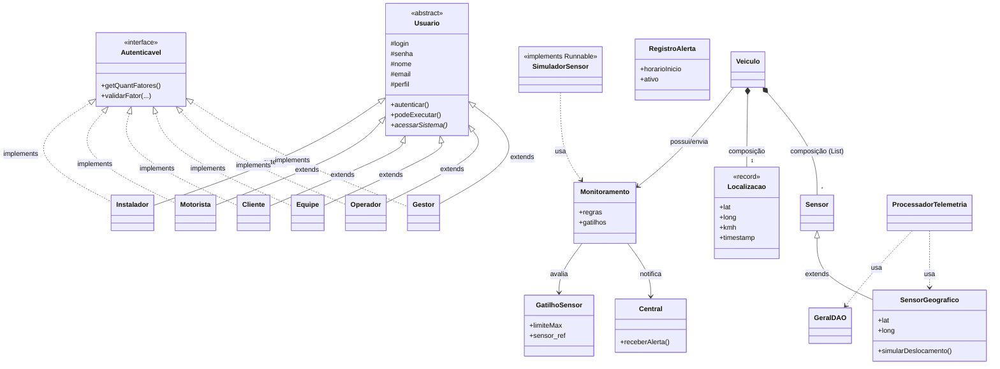

<div align="center">

# 🚗 JHC Telemetria

### Plataforma de Gestão de Frotas com Monitoramento em Tempo Real

[](https://www.java.com)
[](https://openjfx.io/)
[](https://www.sqlite.org/)
[](https://www.bluej.org/)

*Projeto acadêmico — Disciplina de Programação Orientada a Objetos · UFG · 2026*

</div>

---

## 📖 Sobre o Projeto

O **JHC Telemetria** é uma plataforma de IoT veicular desenvolvida para monitoramento de frotas em tempo real. O sistema integra sensores embarcados, rastreamento geográfico via GPS e uma central de alertas, cobrindo desde o diagnóstico preventivo de veículos até o controle de conformidade operacional.

A motivação surgiu de um evento real de março de 2026, em que uma paciente de 91 anos faleceu após uma ambulância do SAMU ter seu percurso obstruído. O sistema busca endereçar falhas de comunicação e rastreamento em situações críticas de mobilidade urbana.

### ✨ Funcionalidades

| Módulo | Descrição |
|---|---|
| 🔐 **Autenticação** | Login com controle de acesso por perfil (RBAC) e autenticação multifator |
| 📍 **Rastreamento GPS** | Leitura de latitude, longitude e velocidade em tempo real com link para Google Maps |
| 📡 **Sensores** | Cadastro, vinculação a veículos e disparo de alertas ao exceder limites configurados |
| 🚨 **Central de Alertas** | Recepção de emergências, localização do veículo e listagem de ocorrências ativas |
| 🖥️ **Interface Gráfica** | Painéis JavaFX distintos por cargo (Administrador, Operador, Cliente) |
| 👥 **Gestão de Usuários** | Cadastro, edição e exclusão de usuários com controle de permissões por nível |
| 🚗 **Gestão de Frota** | Cadastro de veículos com identificador (placa/chassi), tipo e associação a sensores |
| 📋 **Logs do Sistema** | Registro de ações com timestamp, visualização e limpeza reservada ao Administrador |
| 🗄️ **Persistência** | Banco de dados SQLite embutido via JDBC — sem necessidade de servidor externo |

---

## 🏗️ Arquitetura

O projeto segue uma arquitetura em camadas com separação clara de responsabilidades:





> A pasta `old/` na raiz do repositório contém versões anteriores das classes, mantidas apenas como histórico de evolução do projeto. Não faz parte da versão ativa.

---

## 🧩 Modelagem OOP

### Hierarquia de Classes

```mermaid
            ┌──────────────────────┐
            │    <<interface>>     │
            │     Autenticavel     │
            │  + getQuantFatores() │
            │  + validarFator(...) │
            └──────────┬───────────┘
                       │ implements
       ┌───────────────┼──────────────┬──────────────┬──────────────┐
       │               │              │              │              │
 ┌─────┴────┐  ┌───────┴──┐  ┌───────┴──┐  ┌───────┴──┐  ┌────────┴───┐  ┌───────────┐
 │  Gestor  │  │ Operador │  │  Equipe  │  │  Cliente │  │  Motorista │  │ Instalador│
 └──────────┘  └──────────┘  └──────────┘  └──────────┘  └────────────┘  └───────────┘
       │               │              │              │              │              │
       └───────────────┴──────────────┴──────────────┴──────────────┴──────────────┘
                                      │ extends
                              ┌───────┴────────┐
                              │    Usuario      │  <<abstract>>
                              │  # login        │
                              │  # senha        │
                              │  # nome         │
                              │  # email        │
                              │  # perfil       │
                              │  + autenticar() │
                              │  + podeExecutar()│
                              │  + acessarSistema() <<abstract>>
                              └─────────────────┘


  ┌─────────────┐  composição   ┌──────────────────┐
  │   Veiculo   ├───────────────► List<Sensor>      │
  │             │               └──────────────────┘
  │             │  composição   ┌──────────────────┐
  │             ├───────────────►   Localizacao     │  <<record>>
  └──────┬──────┘               │  lat, long, kmh  │
         │                      │  timestamp       │
         ▼                      └──────────────────┘
  ┌──────────────┐
  │ Monitoramento│ ─────────────► Central
  │ + regras     │  notifica      │ + receberAlerta()
  │ + gatilhos   │               └──────────────────
  └──────────────┘
         │ avalia
         ▼
  ┌──────────────┐         ┌──────────────────┐
  │ GatilhoSensor│         │  RegistroAlerta  │
  │ + limiteMax  │         │  + horarioInicio │
  │ + sensor ref │         │  + ativo         │
  └──────────────┘         └──────────────────┘

  ┌──────────────────┐  extends  ┌────────┐
  │  SensorGeografico├───────────► Sensor │
  │  + lat, long     │           └────────┘
  │  + simularDeslocamento()     
  └──────────────────┘

  ┌──────────────────┐  usa  ┌──────────────────┐
  │ SimuladorSensor  ├───────► Monitoramento     │
  │ implements       │       └──────────────────┘
  │ Runnable         │
  └──────────────────┘

  ┌──────────────────────┐  usa  ┌──────────────────┐
  │ ProcessadorTelemetria├───────► SensorGeografico  │
  │                      ├───────► GeralDAO          │
  └──────────────────────┘       └──────────────────┘
```

### Padrões OOP Aplicados

| Conceito | Implementação |
|---|---|
| **Herança** | `Gestor`, `Operador`, `Equipe`, `Cliente`, `Motorista`, `Instalador` estendem `Usuario` |
| **Herança simples** | `SensorGeografico` estende `Sensor`, herdando toda a lógica de leitura |
| **Interface** | `Autenticavel` define contrato para autenticação com 1, 2 ou 3 fatores |
| **Polimorfismo** | `acessarSistema()` com comportamento distinto em cada subclasse |
| **Classe Abstrata** | `Usuario` define o template comum; impede instanciação direta |
| **Encapsulamento** | Atributos `private`/`protected` com getters e setters controlados |
| **Record (Java 16+)** | `Localizacao` como tipo de valor imutável com método auxiliar `toGoogleMapsUrl()` |
| **Enum com comportamento** | `PerfilAcesso` encapsula nível numérico, descrição e lógica de permissões via `temPermissao()` |
| **Composição** | `Veiculo` delega GPS a `Localizacao` e mantém `List<Sensor>` |
| **Runnable / Thread** | `SimuladorSensor` roda em thread separada para simular transmissão contínua |
| **DAO Pattern** | Camada `repository/` isola todo o acesso ao SQLite da lógica de domínio |
| **Método Template** | `podeExecutar()` em `Usuario` delega para `PerfilAcesso.temPermissao()` |
| **RBAC** | Enum `PerfilAcesso` centraliza regras de autorização por ação e nível |

---

## 👥 Controle de Acesso (RBAC)

```
Nível 0 — MOTORISTA
  ✔ Visualizar veículo vinculado e seus sensores
  ✔ Calcular rota e iniciar viagem com transmissão de GPS
  ✔ Autenticação por 1 fator (senha)

Nível 1 — FROTISTA (Gestor)
  ✔ Tudo do nível anterior
  ✔ Visualizar frota completa com filtros
  ✔ Cadastrar e manter veículos e sensores
  ✔ Enviar mensagens para a Central
  ✔ Autenticação por 2 fatores (senha + token)

Nível 2 — OPERADOR
  ✔ Tudo do nível anterior
  ✔ Gerenciar usuários (criar, editar, excluir)
  ✔ Instalar e vincular sensores a usuários
  ✔ Verificar telemetria ativa da frota
  ✔ Autenticação por 2 fatores (senha + token)

Nível 3 — ADMIN (Equipe)
  ✔ Acesso total ao sistema
  ✔ Visualizar e limpar logs do sistema
  ✔ Autenticação por 3 fatores (senha + token + biometria)
```

---

## 🖥️ Fluxo de Navegação (Interface JavaFX)

```
Main.java
    │
    └──► login.fxml (LoginController)
              │
              ├── Credenciais válidas
              │         │
              │         ├── administrador ──► TelaX.fxml  [vincular sensores, ver usuários, logs]
              │         │
              │         ├── operador ────────► TelaZ.fxml  [instalar sensores, telemetria]
              │         │
              │         └── cliente ─────────► TelaY.fxml  [ver meus sensores]
              │
              └── Link "Cadastrar" ──► registrologin.fxml (RegistroLoginController)
```

Após o login, o `MenuController` (carregado via `Menu.fxml`) exibe as opções comuns a todos os perfis: acessar módulo, alterar dados pessoais, alterar senha, excluir conta e logout.

---

## 🗄️ Banco de Dados (SQLite)

O sistema utiliza **SQLite** como banco de dados embutido. O arquivo `jhctelemetria.db` é criado automaticamente na primeira execução pelo `InicializadorBanco.java` — nenhuma instalação de servidor é necessária.

### Estrutura das Tabelas

```sql
CREATE TABLE IF NOT EXISTS usuario (
    id            INTEGER PRIMARY KEY AUTOINCREMENT,
    nome          TEXT NOT NULL,
    email         TEXT UNIQUE NOT NULL,
    login         TEXT UNIQUE NOT NULL,
    senha         TEXT NOT NULL,
    nivel_acesso  INTEGER NOT NULL
);

CREATE TABLE IF NOT EXISTS veiculos (
    id                 INTEGER PRIMARY KEY AUTOINCREMENT,
    usuario_id         INTEGER NOT NULL,
    motorista_id       INTEGER,
    identificador      TEXT NOT NULL,
    tipo_identificador TEXT,
    tipo_veiculo       TEXT,
    ativo              INTEGER DEFAULT 1,
    status_viagem      TEXT DEFAULT 'PARADO',
    FOREIGN KEY (usuario_id)   REFERENCES usuario(id) ON DELETE CASCADE,
    FOREIGN KEY (motorista_id) REFERENCES usuario(id) ON DELETE SET NULL
);

CREATE TABLE IF NOT EXISTS sensores (
    id             INTEGER PRIMARY KEY AUTOINCREMENT,
    veiculo_id     INTEGER NOT NULL,
    categoria      TEXT,
    nome           TEXT NOT NULL,
    und_medida     TEXT,
    tipo_dado      TEXT,
    valor_atual    REAL,
    limite_maximo  REAL,
    atualizado_em  DATETIME DEFAULT CURRENT_TIMESTAMP,
    FOREIGN KEY (veiculo_id) REFERENCES veiculos(id) ON DELETE CASCADE
);

CREATE TABLE IF NOT EXISTS localizacao (
    id             INTEGER PRIMARY KEY AUTOINCREMENT,
    dispositivo_id INTEGER NOT NULL,
    latitude       REAL NOT NULL,
    longitude      REAL NOT NULL,
    velocidade     REAL,
    data_hora      DATETIME,
    FOREIGN KEY (dispositivo_id) REFERENCES veiculos(id) ON DELETE CASCADE
);

CREATE TABLE IF NOT EXISTS logs (
    id             INTEGER PRIMARY KEY AUTOINCREMENT,
    usuario_email  TEXT,
    acao           TEXT NOT NULL,
    data_hora      DATETIME DEFAULT CURRENT_TIMESTAMP
);

CREATE TABLE IF NOT EXISTS mensagens (
    id              INTEGER PRIMARY KEY AUTOINCREMENT,
    remetente_email TEXT NOT NULL,
    conteudo        TEXT NOT NULL,
    data_hora       DATETIME DEFAULT CURRENT_TIMESTAMP
);
```

### Modelo de Dados

```
usuario ──────────────────────────────────────────────┐
│ id, nome, email, login, senha, nivel_acesso         │
└─────────────────────────────────────────────────────┘
         │ 1
         │ N
      veiculos ───────────────────────────────────────┐
      │ id, usuario_id (FK), motorista_id (FK)        │
      │ identificador, tipo_identificador             │
      │ tipo_veiculo, ativo, status_viagem            │
      └────────────────────────────────────────────────┘
               │ 1
               │ N
            sensores
            │ id, veiculo_id (FK)
            │ categoria, nome, und_medida
            │ tipo_dado, valor_atual, limite_maximo

      localizacao                    logs
      │ dispositivo_id (FK)          │ usuario_email
      │ latitude, longitude          │ acao
      │ velocidade, data_hora        │ data_hora

      mensagens
      │ remetente_email
      │ conteudo, data_hora
```

---

## 🛠️ Tecnologias

- **Java 17+** com features modernas (`record`, `switch` expressions, `Text Block`, `instanceof` pattern)
- **JavaFX** — interface gráfica com FXML, `@FXML`, controllers e navegação entre cenas
- **SQLite** — banco de dados relacional embutido via JDBC puro (sem servidor externo)
- **BlueJ** — ambiente de desenvolvimento utilizado no projeto
- **Git / GitHub** — controle de versão com histórico desde maio de 2026

---

## ⚙️ Pré-requisitos

- Java 17 ou superior (`java --version`)
- JavaFX SDK compatível com Java 17
- BlueJ 5+ (ou outra IDE com suporte a JavaFX)
- Nenhum servidor de banco de dados necessário — o SQLite é embutido

---

## 🚀 Instalação e Execução

### 1. Clone o repositório

```bash
git clone https://github.com/VictorEduardo-coder/Gestao-de-Frotas.git
cd Gestao-de-Frotas
```

### 2. Inicialize o banco de dados

Na primeira execução, rode o `InicializadorBanco.java` diretamente para criar o arquivo `jhctelemetria.db` e todas as tabelas:

```bash
# Via linha de comando (com JavaFX no classpath)
java com.telemetria.db.InicializadorBanco
```

Ou, no BlueJ, clique com o botão direito em `InicializadorBanco` e execute o método `main`.

> O arquivo `jhctelemetria.db` será criado automaticamente na pasta raiz do projeto. Nas execuções seguintes, este passo não é necessário.

### 3. Execute a aplicação

```bash
# Via linha de comando
java --module-path /caminho/para/javafx-sdk/lib \
     --add-modules javafx.controls,javafx.fxml \
     -cp . com.telemetria.application.Main
```

Ou, no BlueJ, execute o método `main` da classe `Main`.

---

## 🖥️ Como Usar

Ao iniciar, a tela de **Login** é exibida. O sistema redireciona automaticamente para o painel correto conforme o cargo do usuário autenticado.

### Usuários de desenvolvimento (pré-cadastrados em memória)

| Login | Senha | Cargo | Painel |
|---|---|---|---|
| `adm` | `123` | Administrador | TelaX — vincular sensores, ver usuários, logs |
| `adm1` | `1234` | Operador | TelaZ — telemetria e instalação |

> Novos usuários podem ser criados pela tela de registro acessível na própria tela de login.

---

## ⚠️ Observações Importantes

- A pasta `old/` na raiz contém versões anteriores das classes, mantidas apenas como histórico. Não faz parte da versão ativa do sistema.
- O banco de dados utilizado é **SQLite** (arquivo `jhctelemetria.db`), não PostgreSQL. Nenhum servidor externo é necessário.
- Senhas são armazenadas em texto puro no protótipo atual. Em ambiente de produção, aplique hashing com **bcrypt** ou similar.
- Os tokens de autenticação multifator estão fixos (`"000000"`) para fins de demonstração acadêmica.
- Usuários criados pelo formulário de registro são armazenados **em memória** durante a sessão (via `RegistroLoginController`). A integração completa com o banco SQLite para persistência de novos usuários está prevista para as próximas etapas.

---

## 📅 Histórico de Versões

| Data | Descrição |
|---|---|
| Maio/2026 | Modelagem inicial — interfaces, hierarquia de usuários, `Localizacao` como record |
| Maio/2026 | Implementação dos perfis de acesso (`PerfilAcesso` enum), `Equipe`, `Instalador`, `Motorista` |
| Maio/2026 | Adição de `SimuladorSensor`, `GatilhoSensor`, `Monitoramento`, `Central`, `RegistroAlerta` |
| Junho/2026 | Interface JavaFX completa, migração para SQLite, `InicializadorBanco`, `ProcessadorTelemetria`, `SensorGeografico` |

---

## 👨‍💻 Equipe

| Nome | Matrícula | Função |
|---|---|---|
| **Humberto Nogueira** | 202506862 | Líder de Projeto & Líder Técnico |
| **Victor Eduardo** | 202506944 | Desenvolvedor Backend |
| **João Pedro** | 202403019 | Desenvolvedor Frontend |
| **Raphael Henrique** | 202506943 | Engenheiro de QA / Testes |
| **Vitor Augusto** | 202503278 | Arquiteto de Software & Documentação |

---

<div align="center">

*JHC Telemetria · UFG · 2026*

</div>
